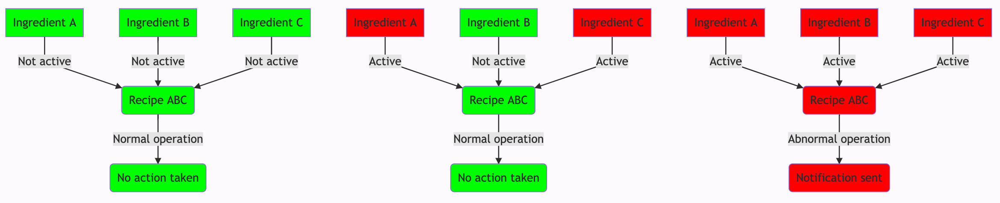
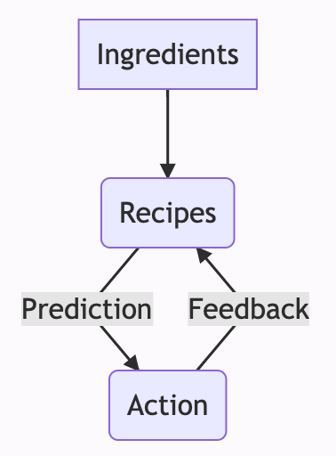
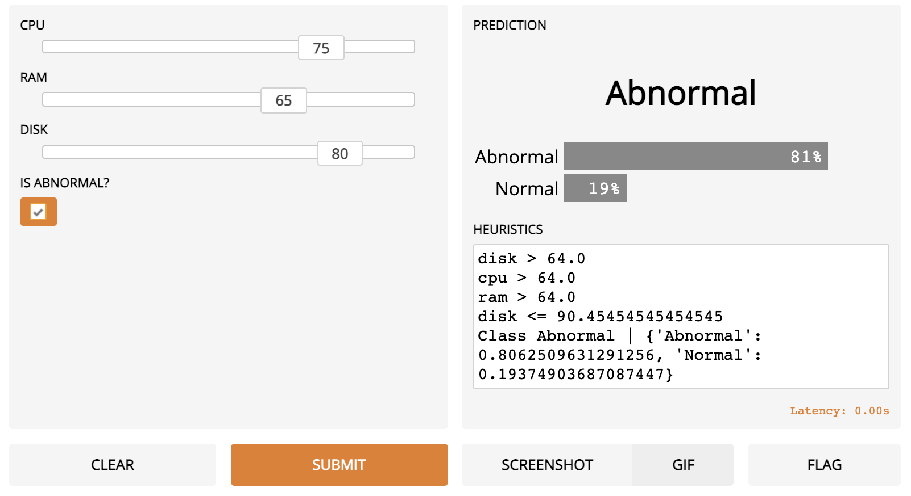
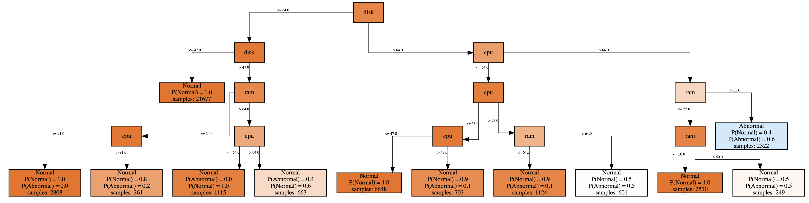

# Abnormality Recipe (ML)

## Motivation

TL;DR [Hacking and Abusing the Platform](https://docs.google.com/document/d/1rI0J5HcWXoyvUkjslF3aSDQNlK9XKR3BOaJwzAkOE-Q) Hack Week project considers anomaly detection in the sense that alerts (a.k.a. ingredients) go through an inference engine (a.k.a. recipe) to decide whether the platform is experiencing an abnormal situation or abuse.

## Machine Learning

An advanced approach would be to derive heuristics based on actual data instead of manually defining the conditions.

To make it even more powerful, false positives/negatives can be reported back to the system, akin to [online machine learning](https://en.wikipedia.org/wiki/Online_machine_learning).

[Random forest](https://en.wikipedia.org/wiki/Random_forest) algorithm might be suitable for such use cases, as well as more specific [incremental decision trees](https://en.wikipedia.org/wiki/Incremental_decision_tree).

## Outcome

The outcome is a toy example that lets anyone simulate single events (as part of the stream) together with a label whether it was an abnormality or not - effectively enabling a self-correcting mechanism via the feedback loop.

Below is a graph representing the heuristics obtained by applying Hoeffding trees to the synthetic data.

